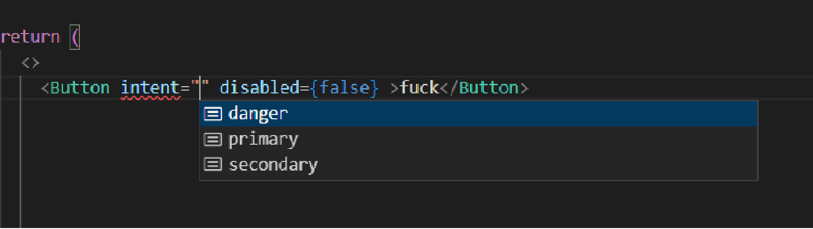
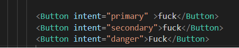
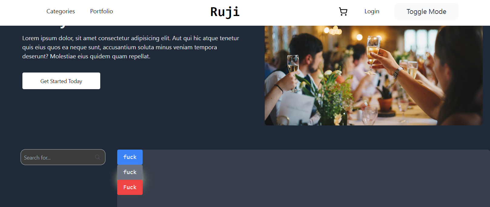

# Class Variance Authority

After finishing Motiflex sit-ups feature, I realized what's the mistake I made with my design system.

First of all, I didn't use any style component library. I want my app to be Neo-brutalism style
, so I have to build design systems from scatch. But, I didn't. The whole project is kinda suck in sense
 of usability. I mean, with Tailwind, I can actually make the style out of it, but I can't make it that reusable. 
 I have to copy and paste the same all over the place.

 "clsx" might solved the problem but when it comes to 10-20 props per component, it's going to be really confusing.

    When it comes to this situation to make your own design system, I want to introduce you with CVA.
    CVA is a class variance authority. It's a simple class that can make your design system reusable.
    That's work perfectly with Tailwindcss and Typescripts.

    Let's see how it works.

    ```ts
    // Button.tsx
    import { cva, VariantProps } from "class-variance-authority";
 
   const ButtonProps = cva(
  "font-mono flex items-center justify-center px-4 py-2 rounded shadow-neo",
  {
    variants: {
      intent: {
        primary: "bg-blue-500 text-white hover:bg-blue-700",
        secondary: "bg-gray-500 text-white shadow-yellow-100 shadow-xl",
        danger: "bg-red-500 text-white",
      },
      fullWidth: {
        true: "w-full",
      },
    },
    defaultVariants: {
      intent: "primary",
    },
  }
);
    ```
   As you can see, You can apply styles under intent props as its variants.
    And you can set default props as well. 

    export it with VariantProps.

    ```tsx
export interface Props
  extends VariantProps<typeof ButtonProps>,
    ```
    When it comes to use it, you can use it like this.

 

The variances shows as intellicense. It's really easy to use and make your design system reusable.

Now I'm gonna show you all of the style using CVA.


    
    and boom
    
