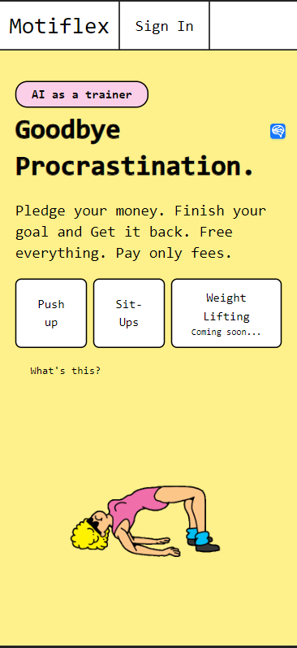

# Motiflex

[Motiflex.co](https://motiflex.co)

Status: <h1 className="text-green-400 text-2xl">Active</h1>

## Description

Motiflex is an app designed to boost your motivation by using your money as a pledge, ensuring you stick to your workout routine. We employ computer vision AI, powered by Tensorflow, to monitor and count your exercises.

Currently, we offer three exciting challenges: push-ups, sit-ups, and weight lifting. 😄

## Features
- Count reps of exercise by AI
- Pledge and reclaim money
- Record your progress that you can review later
- Sign-up and Sign-in

The refund can be calculated like:

***Refund = Initial Pledge - (Missed Days x (Initial Pledge / Total Challenge Days)) - (0.06 x Initial Pledge)***
## Tech stacks
    - T3 stacks
    - Zustand
    - Clerk
    - Stripe
    - TensorFlow.js 
## Current

Finding users (หาคนมาใช้จ้า)

## Logs

### 19 August 2023
&nbsp;&nbsp;&nbsp;&nbsp;- Add situps feature in production completed.
    ### 1 August 2023
&nbsp;&nbsp;&nbsp;&nbsp;- Add terms and conditions.
    ### 10 June 2023
&nbsp;&nbsp;&nbsp;&nbsp;- First launch (Only push-ups counter and refund)
    ### 29 May 2023
&nbsp;&nbsp;&nbsp;&nbsp;- Config Stripe, Clerk and tRPC together
    ### 5 May 2023
&nbsp;&nbsp;&nbsp;&nbsp;- First commit with situp counter

